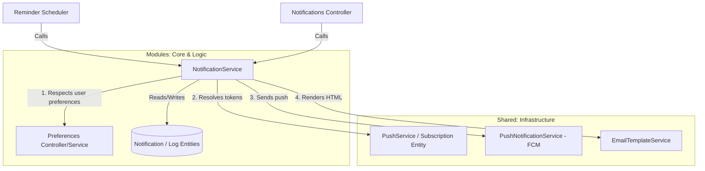

# Notifications Module

This module consolidates the notification preferences, core business logic, API controllers, and delivery dispatch orchestration for the Stellar Uzima platform.

## Responsibility Boundaries

### 1. Business Logic & API Operations (`src/modules/notifications/`)
- **Notification preferences**: Saving and updating user preferences (email, SMS, push options) via API.
- **In-App notifications**: Creating, saving, and reading notifications/history stored in the PostgreSQL database (`Notification` and `NotificationLog` entities).
- **Multi-channel orchestration**: Coordinating delivery across multiple channels (email, SMS, push) in `NotificationService`, while enforcing user preferences and rate-limiting/deduplication.
- **High-level events**: Handlers like `sendCouponExpiryReminder` and `sendPendingTaskDigest` which map to specific business scheduler needs.

### 2. Infrastructure & Low-Level Delivery (`src/shared/notifications/`)
- **FCM integration**: Direct interface with Firebase Cloud Messaging via `PushNotificationService` to send raw push notifications.
- **Push subscriptions**: Managing user device tokens and platform types via `PushService` and `PushSubscription` entity.
- **Email rendering**: Loading and compiling HTML email templates using `EmailTemplateService`.

---

## Architecture Diagram

